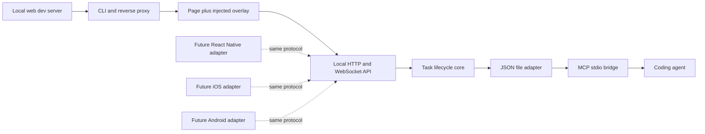

# Architecture

## System shape

The repository is a TypeScript monorepo built with pnpm and Turborepo. TypeScript is not a platform limitation: it implements the first core and web adapter, while interoperability is defined by versioned JSON contracts. Native adapters can be written in Swift or Kotlin and send the same entities over HTTP/WebSocket or a future local transport.



## Package boundaries

| Layer       | Package                      | Responsibility                              | Must not know about          |
| ----------- | ---------------------------- | ------------------------------------------- | ---------------------------- |
| Contracts   | `@visual-intent/protocol`    | Entities, validation, versioned wire format | DOM, storage, agents         |
| Core        | `@visual-intent/core`        | Task creation, revisions, repository port   | HTTP, filesystem, MCP        |
| Adapter     | `@visual-intent/file-store`  | Atomic local JSON persistence               | browser UI, target app       |
| SDK         | `@visual-intent/sdk`         | Typed HTTP calls for consumers              | filesystem implementation    |
| Adapter     | `@visual-intent/web-overlay` | Runtime web capture UI                      | Node filesystem, MCP         |
| Adapter     | `@visual-intent/mcp-server`  | Agent-facing MCP tools                      | browser injection, Git       |
| Composition | `@visual-intent/cli`         | Process lifecycle, proxy, API, WebSocket    | product-specific source code |

Applications compose packages; shared packages do not import from `apps/*`. Provider-specific logic belongs in replaceable adapters.

## Local runtime

The CLI accepts a target such as `http://127.0.0.1:3000` and starts a second loopback server, normally on `7310`.

1. Requests outside `/_visual-intent/*` are proxied to the target.
2. Uncompressed HTML responses receive a script tag before `</body>`.
3. Assets and the target's development WebSockets pass through the proxy.
4. The injected script renders in a Shadow DOM, reducing CSS collisions.
5. Task creation goes to a same-origin local HTTP endpoint.
6. Changes are broadcast to open overlays over WebSocket.
7. The file adapter serializes concurrent writers with a lock and replaces the JSON file atomically.
8. A separate MCP stdio process can read and update the same file.

## Why a reverse proxy

The proxy proves the workflow without requiring target applications to install or import an SDK. It also gives the overlay and API one origin. The trade-off is that strict CSP headers are removed from proxied HTML in the local review surface so the injected script can run. The original dev server response is unchanged.

This is a development tool, not a production proxy. The CLI rejects non-loopback targets and non-loopback bind addresses.

## Data and consistency

The local store is a readable document:

```text
.visual-intent/tasks.json
```

Writes use a temporary file followed by an atomic rename. A short-lived adjacent lock protects the read-modify-write cycle across the daemon and MCP process. Every task has a positive `revision`; updates can include `expectedRevision`, producing a conflict instead of silently losing newer data.

This is sufficient for one-machine development. It is not a multi-user database, distributed lock, backup system, or audit ledger.

## Agent boundary

The MCP server exposes task context and task-result updates only. It deliberately does not run shell commands, edit source, commit, or push. The connected coding agent operates under its own repository permissions and confirmation policies. This keeps visual capture reusable across Codex, Claude Code, Cursor, and future agents.

## Future collaboration backend

A collaboration backend is introduced only when shared or external review needs it. It should implement the same task-store and event contracts while adding server-owned concerns:

- organizations, projects, review sessions, and participants;
- authenticated principals, authorization, invitations, and guest expiry;
- PostgreSQL persistence, object storage for media, and durable events;
- idempotency, audit history, rate limits, retention, and deletion;
- connector outbox, retries, delivery status, and secret management.

The local file adapter remains valid and does not become a thin client that requires the hosted service.

## Connector architecture

Connectors are plugins behind a stable outbound port, for example:

```ts
interface TaskDestination {
  publish(task: Task, context: PublishContext): Promise<PublishResult>;
}
```

Jira, Yandex Tracker, and Notion adapters translate Visual Intent tasks into provider-specific fields. Coding-agent adapters consume the same task through MCP or the SDK. Credentials, retries, idempotency keys, and external IDs stay outside core. No connector is implemented in the MVP.

## Security boundaries

- Loopback bind and loopback target are enforced.
- Request bodies are limited to 1 MB.
- Task payloads are schema-validated.
- The overlay uses text nodes for captured task display rather than rendering task HTML.
- The JSON store may contain visible page text and comments; it is Git-ignored by default and should be treated as project data.
- There is no authentication. Anyone able to access the local process can read and update tasks, which is why remote binding is intentionally unavailable.
