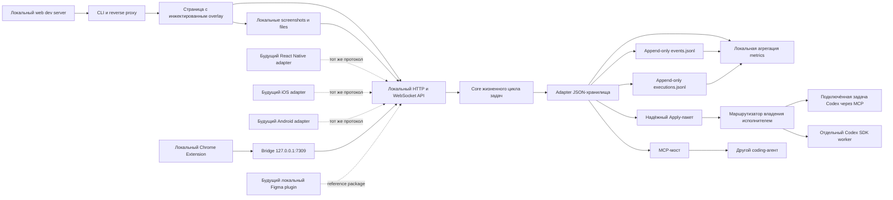
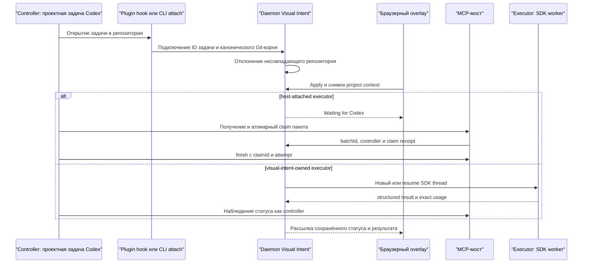
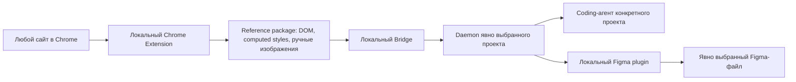

# Архитектура

## Общая форма системы

Репозиторий представляет собой TypeScript-monorepo на pnpm и Turborepo. TypeScript не ограничивает платформы: на нём реализованы первый core и web-adapter, а совместимость определяется версионируемыми JSON-контрактами. Native adapters могут быть написаны на Swift или Kotlin и отправлять те же сущности через HTTP/WebSocket либо будущий локальный transport.



## Границы пакетов

| Слой        | Пакет                        | Ответственность                                          | Не должен знать о                 |
| ----------- | ---------------------------- | -------------------------------------------------------- | --------------------------------- |
| Contracts   | `@visual-intent/protocol`    | Сущности, валидация, версионируемый wire format          | DOM, хранение, агенты             |
| Core        | `@visual-intent/core`        | Создание задач, итерации, оценки, repository port        | HTTP, filesystem, MCP             |
| Adapter     | `@visual-intent/file-store`  | Снимок состояния и append-only аналитические журналы     | браузерный UI, целевое приложение |
| SDK         | `@visual-intent/sdk`         | Типизированные HTTP-вызовы, включая события и выполнения | реализация filesystem             |
| Adapter     | `@visual-intent/web-overlay` | Runtime UI для фиксации контекста в браузере             | Node filesystem, MCP              |
| Adapter     | `@visual-intent/mcp-server`  | MCP-инструменты для агентов                              | инжектирование в браузер, Git     |
| Composition | `@visual-intent/cli`         | Жизненный цикл процесса, proxy, API, dispatcher          | исходный код конкретного продукта |
| Plugin      | `plugins/visual-intent`      | Codex hook, skill и MCP-инструменты daemon               | реализация целевого проекта       |

Приложения собирают пакеты вместе; общие пакеты не импортируют код из `apps/*`. Логика конкретного provider должна находиться в заменяемых adapters.

## Локальный runtime

CLI принимает target, например `http://127.0.0.1:3000`, и запускает второй loopback-сервер, обычно на порту `7310`.

1. Запросы за пределами `/_visual-intent/*` проксируются в target.
2. В несжатые HTML-ответы перед `</body>` добавляется тег script.
3. Ассеты и development WebSocket целевого приложения проходят через proxy.
4. Инжектированный script отображается в Shadow DOM, что уменьшает конфликты CSS.
5. Add task записывает элемент `ready` в локальный HTTP endpoint того же origin.
6. Скриншоты и файлы сначала загружаются в проектное media-хранилище, получают серверные ID, SHA-256 и относительные пути; задача может сослаться максимум на три подтверждённых вложения.
7. Apply атомарно создаёт один надёжный пакет, снимает Git-baseline и неизменяемый снимок `.visual-intent/context.md`, затем убирает готовые элементы из редактируемого Backlog и сразу скрывает их экранные якоря без удаления обратной связи.
8. ProjectSettings определяет dirty-worktree policy. Подключённый `host-attached` чат по умолчанию получает пакет сразу с сохранённым baseline; режим `require-confirmation` и автономный executor переводят пакет в `needs_input` до подтверждения точного fingerprint.
9. Для `host-attached` и отключённой сессии подтверждённый пакет остаётся в `waiting_for_executor`. Подключённая задача Codex забирает его атомарно через MCP и получает claim receipt: `claimId`, `attempt` и ID controller. Finish принимается только с тем же receipt; daemon не возобновляет desktop-owned thread через SDK.
10. Только режим `visual-intent-owned` переводит пакет в `queued` и запускает отдельный SDK worker. Его thread ID сохраняется при событии `thread.started`, поэтому последующие Apply и перезапуски продолжают тот же контекст.
11. При claim baseline снимается повторно, а при finish сравнение отделяет `batchChangedFiles` от `preExistingDirtyFiles`.
12. Агент возвращает результат каждой задачи и самостоятельно классифицирует категории и масштаб работы; подтверждённый SDK usage относится ко всей попытке пакета.
13. File adapter атомарно обновляет `tasks.json` вместе с execution outbox, затем идемпотентно проецирует попытку в `executions.jsonl` и добавляет диагностические факты в `events.jsonl`.
14. Выполненная задача попадает во вкладку Ready; пользователь ставит независимую оценку качества от 1 до 5 звёзд. In progress и Ready отображают историю свёрнутыми Apply-пакетами, оценённые карточки приглушаются, а якоря остаются только у Backlog. Отдельное workflow-решение `needs_revision` создаёт новый раунд той же итерации, остальные оценки ничего не откатывают.
15. Изменения рассылаются открытым overlay через аутентифицированный локальный WebSocket в стабильном внешнем конверте `{ type: "tasks.changed", task: payload }`.
16. File adapter сериализует конкурирующие записи через lock и атомарно заменяет JSON-файл.
17. MCP-клиенты могут просматривать, подтверждать и повторять пакеты. Забирать и завершать через MCP разрешено только host-attached пакетам; пакетами автономного worker управляет сам daemon.

## Маршрутизация между проектом и задачей Codex



По умолчанию новая сессия отключена. Поэтому задача разработки Visual Intent может запустить proxy для другого продукта, не становясь исполнителем этого продукта. `ProjectSession.controller` хранит текущую проектную задачу Codex для наблюдения и продуктового диалога, `ProjectSession.executor` определяет активный маршрут конкретного Apply, а `ProjectSession.sdkWorker` отдельно сохраняет постоянную идентичность автономной SDK-задачи. Подключение controller не заменяет уже активный `visual-intent-owned` worker. Автономный thread не является controller и не должен иметь тот же ID. Поле `executor.ownership` различает `host-attached` и `visual-intent-owned`: один только `threadId` больше не даёт daemon права запускать resume. Hook плагина упрощает подключение, а команда CLI `attach` обеспечивает ту же привязку без обязательной установки плагина.

Для автономного режима daemon атомарно создаёт `.visual-intent/worker-lease.json` с PID и случайным token: второй живой локальный процесс не может параллельно управлять тем же worker. Stale или повреждённая lease безопасно заменяется, а release удаляет только собственный token. При штатном завершении daemon ждёт dispatcher `idle`, поэтому lease живёт до окончания активного SDK-turn. После аварийного завершения следующий процесс с lease распознаёт оборванный `visual-intent-owned` пакет `in_progress`. Он становится `failed` с причиной `worker_interrupted`, сохраняет видимый частичный diff и допускает только явный Retry; автоматического отката файлов нет.

Граница crash-safety локального MVP: `SIGKILL` убивает daemon без cleanup-hook, а Codex SDK не предоставляет Visual Intent PID дочернего процесса для доказуемого завершения process group. Поэтому recovery не запускает оборванный пакет автоматически; перед ручным Retry пользователь или агент должен убедиться, что старый Codex-процесс завершился. Resume того же SDK thread дополнительно защищён active-writer конфликтом, но это не заменяет полноценный worker supervisor будущей версии.

Эта recovery намеренно не распространяется на прерванный host-attached claim: daemon не владеет процессом и историей внешней задачи Codex и не может достоверно решить, завершилась ли она. Такой `in_progress` пакет в текущем MVP требует ручной диагностики, а не автоматического возврата в очередь.

Пакет в состоянии `needs_input` или `failed` остаётся сохранённым. После устранения указанной причины пользователь или проектный агент может явно повторить тот же пакет; комментарии не нужно создавать заново. Для обычного `needs_input` непустой ответ сохраняется как continuation, номер попытки увеличивается, а только нерешённые задачи сначала возвращаются в `queued` и затем снова переходят в `in_progress` после claim. Dirty-worktree является отдельным случаем: пока изменения сохраняются, обычный retry запрещён, а продолжение требует отдельного подтверждения пользователя в overlay или через MCP-инструмент с точным fingerprint.

## Почему используется reverse proxy

Proxy позволяет доказать полезность сценария без установки или импорта SDK в целевые приложения. Он также даёт overlay и API единый origin. Компромисс состоит в том, что строгие заголовки CSP удаляются из проксируемого HTML в локальной поверхности ревью, чтобы инжектированный script мог работать. Ответ исходного dev server при этом не изменяется.

Это development-инструмент, а не production proxy. CLI отклоняет target и bind address, которые не являются loopback-адресами.

## Данные и согласованность

Локальное хранилище — читаемый документ, содержащий задачи, одну проектную сессию и Apply-пакеты. Daemon определяет путь из канонического репозитория, переданного через `--repo`, а не из директории, в которой был запущен сам Visual Intent:

```text
<target-repository>/.visual-intent/tasks.json
<target-repository>/.visual-intent/context.md
<target-repository>/.visual-intent/attachments/<attachment-id>.<ext>
<target-repository>/.visual-intent/attachments/<attachment-id>.meta.json
<target-repository>/.visual-intent/usage/events.jsonl
<target-repository>/.visual-intent/usage/executions.jsonl
```

Метаданные подключения находятся рядом в `<target-repository>/.visual-intent/connection.json`. Размещение задач, подключения, вложений и аналитики внутри целевого репозитория даёт каждому проекту изолированную локальную историю и не превращает репозиторий продукта Visual Intent в общую директорию данных. Вся папка добавляется в локальный Git exclude этого репозитория и не коммитится.

`tasks.json` — операционный снимок, из которого восстанавливаются текущие задачи, сессия, настройки, пакеты, итерации и пользовательские оценки. В нём же находится короткоживущий durable outbox execution-receipt: terminal batch и точный receipt записываются одним атомарным обновлением, после чего receipt идемпотентно проецируется в JSONL. `context.md` — редактируемый человеком устойчивый briefing проекта; конкретный Apply хранит его собственный ограниченный снимок и не перечитывает более новую версию при выполнении. `events.jsonl` хранит неизменяемые факты жизненного цикла, а `executions.jsonl` — одну запись каждой завершённой попытки Apply. HTTP и SDK предоставляют read-only чтение этих журналов; CLI-команда `visual-intent metrics` берёт задачи и пакеты из `tasks.json`, события и попытки из двух файлов `usage/` и строит локальную сводку без облачного backend.

Для визуальных code-change задач `context.md` может содержать проектные команды запуска, rebuild/restart и локальный URL проверки. Isolated worker обязан применить этот маршрут и посмотреть фактически отрисованный интерфейс; успешные тесты, build и ответ HTTP 200 сами по себе не означают, что пользователь уже видит изменение. Если runtime нельзя безопасно запустить или проверить, worker возвращает `needs_input`, а не `completed`. В `notes` завершённой задачи он кратко фиксирует проверенную поверхность, выполненный restart/rebuild и наблюдаемый результат.

Это усиление контракта worker, а не независимая семантическая проверка daemon: локальный MVP сохраняет отчёт агента, но не доказывает автоматически, что пиксели соответствуют намерению. Окончательное принятие результата остаётся за пользователем через оценку и следующий раунд правок.

Журналы не дублируют пользовательский комментарий, DOM-снимок или бинарные вложения. Event содержит ID, время, статусы и безопасные агрегаты; execution дополнительно содержит агентное резюме результата и пути изменённых файлов. Поэтому журналы меньше основного store, но всё равно являются локальными данными проекта, а не анонимной телеметрией.

CLI-команда `visual-intent reset --repo <path> --yes` очищает измерительную историю только явно указанного проекта: задачи, Apply-пакеты, durable execution outbox, журналы `usage/` и вложения. Она сохраняет проектную сессию, настройки, подключение, `context.md`, конфигурацию запуска и файлы репозитория. File adapter блокирует сброс при пакетах `waiting_for_executor`, `queued` или `in_progress` и при занятом автономном executor, чтобы очистка не оборвала уже переданную агенту работу.

Текущий overlay в Chrome предпочитает browser-level захват текущей вкладки через `getDisplayMedia`: пользователь явно разрешает доступ к вкладке, после чего Visual Intent вырезает выбранную область из фактического потока пикселей. Это позволяет захватывать canvas, video, cross-origin изображения и временный слой рисунков так, как их отрисовал браузер. DOM-render через встроенный `html2canvas` с нормализацией современных CSS-цветов остаётся только fallback для окружений без browser capture. Будущий Chrome Extension заменит диалог выбора источника на контролируемый extension capture adapter.

## Локальное Chrome Extension и будущая связка с Figma

Локальные плагины проектируются как два adapters вокруг общего reference package:



Reference package содержит origin URL без приватных query/fragment, viewport, выбранный selector/region, безопасный снимок доступной структуры, allowlist computed styles, ссылки на загруженные daemon медиа и явное назначение. Текущий Chrome adapter выражает структуру через обычные `Node` и `Relation`, поэтому coding-агент получает тот же protocol task, а не отдельный несовместимый формат. Браузер не передаёт произвольные локальные пути, а Figma plugin не выбирает файл или проект без действия пользователя.

Один Bridge на `127.0.0.1:7309` читает server-owned регистрации запущенных daemon из пользовательской директории, health-check-ом отбрасывает устаревшие процессы и показывает расширению только безопасные данные сессии. Токены daemon остаются внутри Bridge; расширение выбирает непрозрачный `sessionId`. Это позволяет одновременно работать с несколькими проектами без конфликта портов и репозиториев.

До появления облачной коллаборации пакеты хранятся локально вне Git в управляемой директории Visual Intent. В папку конкретного репозитория копируются только те данные, которые пользователь явно прикрепил к его задаче. Публичная публикация расширений, marketplace review, аккаунты организации и hosted backend являются отдельным будущим этапом и не нужны для development-установки на одном компьютере.

Снимок записывается через временный файл с последующим атомарным rename. Краткоживущий соседний lock защищает цикл чтения-изменения-записи между daemon и MCP-процессом; append в JSONL проходит под тем же процессным контуром сериализации. У каждой задачи есть положительная `revision`; обновления могут передавать `expectedRevision`, вызывая конфликт вместо незаметной потери более новых данных. Старые файлы с задачами в очереди мигрируются на месте: задачи без lineage получают первый раунд собственной итерации, legacy-пакеты получают `attempt = 1`, а задачи без пакета объединяются в ожидающий пакет, а не удаляются.

События жизненного цикла остаются append-only диагностическим журналом, но критичный `ExecutionRecord` защищён durable outbox. После аварийного завершения операционный снимок остаётся источником истины: pending receipt читается аналитикой прямо из outbox и при следующей операции идемпотентно переносится в `executions.jsonl`. Проекция дедуплицируется по паре `batchId + attempt`; частично наблюдаемые операции сохраняются только как `completeness = partial`, а не дополняются догадками.

Точный token usage доступен напрямую для `visual-intent-owned` SDK worker и относится ко всему завершённому SDK turn одного Apply-пакета. Worker явно закрепляет модель и reasoning-политику запуска, чтобы стоимость не вычислялась по изменяемой пользовательской конфигурации задним числом. Подключённая `host-attached` задача Codex живёт за границей daemon: пока доверенный host receipt не передан, execution сохраняет `usage.availability = unavailable`. У многозадачного Apply токены принадлежат пакету целиком; искусственная стоимость отдельных карточек не хранится.

API-эквивалентная стоимость вычисляется в provider-specific adapter CLI сразу после получения SDK usage и сохраняется внутри того же `BatchUsage`. Receipt содержит модель, точную арифметику по token usage и неизменяемый снимок официального тарифа; overlay только отображает сохранённое значение и никогда не пересчитывает старую историю по сегодняшней цене. После гарантированного периода промотарифа adapter возвращает стоимость `unavailable`, пока снимок не обновлён из официального источника. Reasoning входит в Output, cached input входит в Input. Из-за агрегированного usage SDK расчёт использует short-context ставку для всего turn, визуально помечается знаком `≈` и честно считается оценкой, а не биллинговым документом OpenAI. Одиночный пакет проецирует эту статистику в одну Ready-карточку, многозадачный — только в заголовок и раскрываемую область пакета.

Пользовательская оценка не является командой Git. `TaskRating` от 1 до 5 измеряет качество и может быть заменён без повторного запуска. `accepted`, `needs_revision` и `not_accepted` остаются workflow-решениями; только `needs_revision` создаёт связанную задачу следующего раунда, а `not_accepted` не удаляет и не откатывает файлы.

Этого достаточно для разработки и честной локальной продуктовой аналитики на одном компьютере. Это не многопользовательская база данных, распределённая блокировка, система резервного копирования или юридически значимый журнал аудита.

## Граница агента

Daemon присваивает каждой создаваемой задаче репозиторий из `--repo`; payload браузера не может выбирать filesystem target. Подключение задачи Codex должно повторно передать канонический корень репозитория и отклоняется, если он отличается от сохранённой сессии. Codex dispatcher запускается с правом записи в workspace, без сетевого доступа и интерактивных подтверждений; его prompt запрещает commits, pushes, deploy, изменение credentials, создание worktrees и разрушительные действия. ProjectSettings хранится в проектном store с ревизией. Политика `allow-host-attached` не отключает baseline и применяется только к подключённой desktop-задаче; автономный worker остаётся за fingerprint-gate. CLI-флаг `--allow-dirty` оставлен как осознанное глобальное исключение для локальной автоматизации и фиксируется в пакете как источник одобрения `cli`.

MCP-мосты предоставляют контекст и операции жизненного цикла задач и пакетов, но не произвольный shell-доступ. API и MCP отклоняют попытку host-attached клиента забрать или завершить `visual-intent-owned` пакет. Для host-attached маршрута claim создаёт server-owned receipt, а finish проверяет `claimId`, ожидаемый `attempt` и тот же controller thread; одна только строка batch ID недостаточна. Другие coding-агенты сами отвечают за изучение исходников, редактирование и проверку внутри указанного репозитория. Это сохраняет визуальный сбор контекста переиспользуемым между Codex, Claude Code, Cursor и будущими агентами.

## Будущий collaboration backend

Collaboration backend появится только тогда, когда понадобится общее или внешнее ревью. Он должен реализовать те же контракты task store и событий, добавляя серверные обязанности:

- организации, проекты, сессии ревью и участников;
- аутентифицированные principals, авторизацию, приглашения и срок действия гостевого доступа;
- PostgreSQL-хранилище, object storage для медиа и надёжные события;
- идемпотентность, историю аудита, rate limits, retention и удаление;
- connector outbox, повторы, статус доставки и управление секретами.

Локальный file adapter остаётся полноценным режимом и не превращается в тонкий клиент, которому обязательно нужен hosted service.

## Архитектура connectors

Connectors — это plugins за стабильным outbound port, например:

```ts
interface TaskDestination {
  publish(task: Task, context: PublishContext): Promise<PublishResult>;
}
```

Adapters Jira, Яндекс Трекера и Notion преобразуют задачи Visual Intent в поля конкретного provider. Adapters coding-агентов получают ту же задачу через MCP или SDK. Credentials, retries, idempotency keys и external IDs остаются за пределами core. В MVP connectors не реализованы.

## Границы безопасности

- Принудительно используются loopback bind и loopback target.
- Размер request body ограничен 1 МБ.
- Payload задач проверяется по схеме.
- JSON-запрос ограничен 1 МБ, а одно бинарное вложение — 10 МБ; задача содержит не более трёх вложений.
- Путь, размер и SHA-256 каждого attachment принадлежат daemon и повторно проверяются перед созданием задачи.
- Случайный токен каждого daemon защищает все операции изменения и WebSocket Visual Intent.
- В целевом репозитории создаётся исключённый из Git файл подключения с правами `0600` в папке `.visual-intent/`.
- Overlay использует text nodes для отображения сохранённых задач и не рендерит HTML из их содержимого.
- JSON-хранилище может содержать видимый текст страницы и комментарии; по умолчанию оно исключено из Git и должно рассматриваться как данные проекта.
- Read-only loopback endpoints в MVP остаются без аутентификации. Токен — граница локальной сессии, а не пользовательская аутентификация и не замена облачной модели безопасности.
