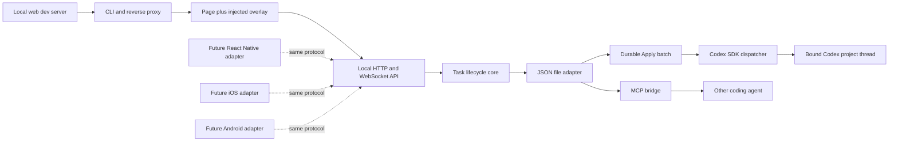
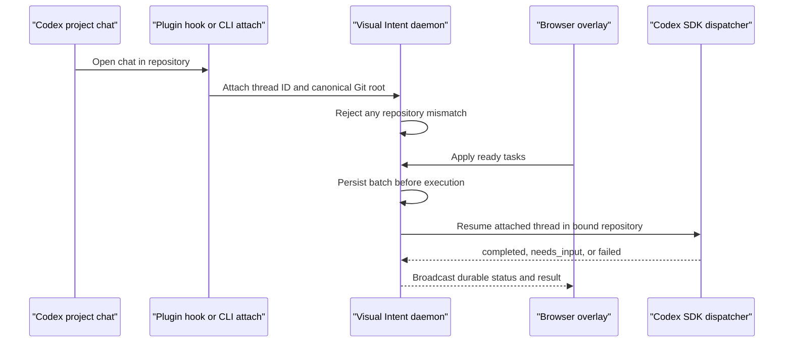

# Architecture

## System shape

The repository is a TypeScript monorepo built with pnpm and Turborepo. TypeScript is not a platform limitation: it implements the first core and web adapter, while interoperability is defined by versioned JSON contracts. Native adapters can be written in Swift or Kotlin and send the same entities over HTTP/WebSocket or a future local transport.



## Package boundaries

| Layer       | Package                      | Responsibility                              | Must not know about           |
| ----------- | ---------------------------- | ------------------------------------------- | ----------------------------- |
| Contracts   | `@visual-intent/protocol`    | Entities, validation, versioned wire format | DOM, storage, agents          |
| Core        | `@visual-intent/core`        | Task creation, revisions, repository port   | HTTP, filesystem, MCP         |
| Adapter     | `@visual-intent/file-store`  | Atomic local JSON persistence               | browser UI, target app        |
| SDK         | `@visual-intent/sdk`         | Typed HTTP calls for consumers              | filesystem implementation     |
| Adapter     | `@visual-intent/web-overlay` | Runtime web capture UI                      | Node filesystem, MCP          |
| Adapter     | `@visual-intent/mcp-server`  | Agent-facing MCP tools                      | browser injection, Git        |
| Composition | `@visual-intent/cli`         | Process lifecycle, proxy, API, dispatcher   | product-specific source code  |
| Plugin      | `plugins/visual-intent`      | Codex hook, skill, daemon-backed MCP tools  | target-project implementation |

Applications compose packages; shared packages do not import from `apps/*`. Provider-specific logic belongs in replaceable adapters.

## Local runtime

The CLI accepts a target such as `http://127.0.0.1:3000` and starts a second loopback server, normally on `7310`.

1. Requests outside `/_visual-intent/*` are proxied to the target.
2. Uncompressed HTML responses receive a script tag before `</body>`.
3. Assets and the target's development WebSockets pass through the proxy.
4. The injected script renders in a Shadow DOM, reducing CSS collisions.
5. Add task writes a `ready` item to a same-origin local HTTP endpoint.
6. Apply atomically creates one durable batch and moves all ready items to `queued`; the editable UI queue becomes empty without deleting feedback.
7. A disconnected session keeps the batch at `waiting_for_executor` until an exact repository and Codex thread are attached.
8. The dispatcher claims a connected batch, resumes that Codex thread with the bound repository as its working directory, and records completion or a visible failure.
9. Changes are broadcast to open overlays over an authenticated local WebSocket.
10. The file adapter serializes concurrent writers with a lock and replaces the JSON file atomically.
11. MCP clients can inspect, retry, claim, and finish the same batches through the daemon or the compatibility file bridge.

## Project-chat routing



The default session is disconnected. Therefore a Visual Intent development chat can run a proxy for another product without becoming that product's executor. Attachment is explicit and server-validated. The plugin hook improves convenience, while the CLI attach command provides the same binding without requiring the plugin.

A `needs_input` or `failed` batch remains durable. After the reported blocker is resolved, the user or project agent can explicitly retry the same batch; task comments do not need to be recreated.

## Why a reverse proxy

The proxy proves the workflow without requiring target applications to install or import an SDK. It also gives the overlay and API one origin. The trade-off is that strict CSP headers are removed from proxied HTML in the local review surface so the injected script can run. The original dev server response is unchanged.

This is a development tool, not a production proxy. The CLI rejects non-loopback targets and non-loopback bind addresses.

## Data and consistency

The local store is a readable document containing tasks, one project session, and Apply batches:

```text
.visual-intent/tasks.json
```

Writes use a temporary file followed by an atomic rename. A short-lived adjacent lock protects the read-modify-write cycle across the daemon and MCP process. Every task has a positive `revision`; updates can include `expectedRevision`, producing a conflict instead of silently losing newer data. Older queued task files are migrated in place: orphaned tasks are grouped into a waiting batch instead of being dropped.

This is sufficient for one-machine development. It is not a multi-user database, distributed lock, backup system, or audit ledger.

## Agent boundary

The daemon stamps every created task with the repository passed through `--repo`; browser payloads cannot select a filesystem target. A thread attachment must repeat the canonical repository root and is rejected when it differs from the stored session. The Codex dispatcher runs with workspace-write access, no network access, and no interactive approvals; its prompt forbids commits, pushes, deploys, credential changes, worktrees, and destructive actions. It also stops before editing when the repository is already dirty unless the operator deliberately enables `--allow-dirty`.

The MCP bridges expose task/batch context and lifecycle operations, not arbitrary shell access. Other coding agents remain responsible for source inspection, edits, and verification inside the stamped repository. This keeps visual capture reusable across Codex, Claude Code, Cursor, and future agents.

## Future collaboration backend

A collaboration backend is introduced only when shared or external review needs it. It should implement the same task-store and event contracts while adding server-owned concerns:

- organizations, projects, review sessions, and participants;
- authenticated principals, authorization, invitations, and guest expiry;
- PostgreSQL persistence, object storage for media, and durable events;
- idempotency, audit history, rate limits, retention, and deletion;
- connector outbox, retries, delivery status, and secret management.

The local file adapter remains valid and does not become a thin client that requires the hosted service.

## Connector architecture

Connectors are plugins behind a stable outbound port, for example:

```ts
interface TaskDestination {
  publish(task: Task, context: PublishContext): Promise<PublishResult>;
}
```

Jira, Yandex Tracker, and Notion adapters translate Visual Intent tasks into provider-specific fields. Coding-agent adapters consume the same task through MCP or the SDK. Credentials, retries, idempotency keys, and external IDs stay outside core. No connector is implemented in the MVP.

## Security boundaries

- Loopback bind and loopback target are enforced.
- Request bodies are limited to 1 MB.
- Task payloads are schema-validated.
- A random per-daemon token protects all mutations and the Visual Intent WebSocket.
- The target repository receives a mode-`0600` connection file under its ignored `.visual-intent/` directory.
- The overlay uses text nodes for captured task display rather than rendering task HTML.
- The JSON store may contain visible page text and comments; it is Git-ignored by default and should be treated as project data.
- Read-only loopback endpoints remain unauthenticated in the MVP. This token is a local session boundary, not user authentication or a substitute for a cloud security model.
