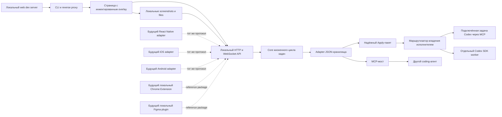
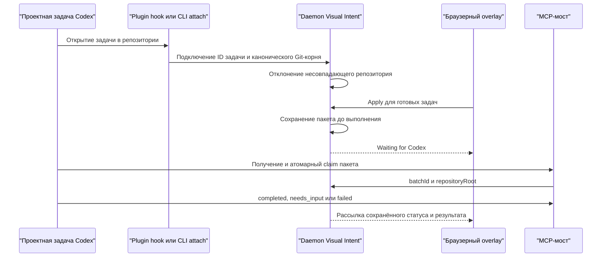
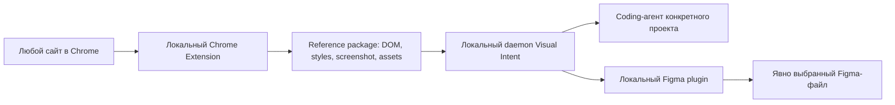

# Архитектура

## Общая форма системы

Репозиторий представляет собой TypeScript-monorepo на pnpm и Turborepo. TypeScript не ограничивает платформы: на нём реализованы первый core и web-adapter, а совместимость определяется версионируемыми JSON-контрактами. Native adapters могут быть написаны на Swift или Kotlin и отправлять те же сущности через HTTP/WebSocket либо будущий локальный transport.



## Границы пакетов

| Слой        | Пакет                        | Ответственность                                 | Не должен знать о                 |
| ----------- | ---------------------------- | ----------------------------------------------- | --------------------------------- |
| Contracts   | `@visual-intent/protocol`    | Сущности, валидация, версионируемый wire format | DOM, хранение, агенты             |
| Core        | `@visual-intent/core`        | Создание задач, ревизии, repository port        | HTTP, filesystem, MCP             |
| Adapter     | `@visual-intent/file-store`  | Атомарное локальное JSON-хранение               | браузерный UI, целевое приложение |
| SDK         | `@visual-intent/sdk`         | Типизированные HTTP-вызовы для потребителей     | реализация filesystem             |
| Adapter     | `@visual-intent/web-overlay` | Runtime UI для фиксации контекста в браузере    | Node filesystem, MCP              |
| Adapter     | `@visual-intent/mcp-server`  | MCP-инструменты для агентов                     | инжектирование в браузер, Git     |
| Composition | `@visual-intent/cli`         | Жизненный цикл процесса, proxy, API, dispatcher | исходный код конкретного продукта |
| Plugin      | `plugins/visual-intent`      | Codex hook, skill и MCP-инструменты daemon      | реализация целевого проекта       |

Приложения собирают пакеты вместе; общие пакеты не импортируют код из `apps/*`. Логика конкретного provider должна находиться в заменяемых adapters.

## Локальный runtime

CLI принимает target, например `http://127.0.0.1:3000`, и запускает второй loopback-сервер, обычно на порту `7310`.

1. Запросы за пределами `/_visual-intent/*` проксируются в target.
2. В несжатые HTML-ответы перед `</body>` добавляется тег script.
3. Ассеты и development WebSocket целевого приложения проходят через proxy.
4. Инжектированный script отображается в Shadow DOM, что уменьшает конфликты CSS.
5. Add task записывает элемент `ready` в локальный HTTP endpoint того же origin.
6. Скриншоты и файлы сначала загружаются в проектное media-хранилище, получают серверные ID, SHA-256 и относительные пути; задача может сослаться максимум на три подтверждённых вложения.
7. Apply атомарно создаёт один надёжный пакет, снимает Git-baseline и убирает готовые элементы из редактируемой очереди без удаления обратной связи.
8. ProjectSettings определяет dirty-worktree policy. Подключённый `host-attached` чат по умолчанию получает пакет сразу с сохранённым baseline; режим `require-confirmation` и автономный executor переводят пакет в `needs_input` до подтверждения точного fingerprint.
9. Для `host-attached` и отключённой сессии подтверждённый пакет остаётся в `waiting_for_executor`. Подключённая задача Codex забирает его атомарно через MCP; daemon не возобновляет desktop-owned thread через SDK.
10. Только режим `visual-intent-owned` переводит пакет в `queued` и запускает отдельный SDK worker. Созданный worker можно возобновлять, потому что им владеет сам Visual Intent.
11. При claim baseline снимается повторно, а при finish сравнение отделяет `batchChangedFiles` от `preExistingDirtyFiles`.
12. Изменения рассылаются открытым overlay через аутентифицированный локальный WebSocket.
13. File adapter сериализует конкурирующие записи через lock и атомарно заменяет JSON-файл.
14. MCP-клиенты могут просматривать, подтверждать, повторять, забирать и завершать те же пакеты через daemon или совместимый файловый мост.

## Маршрутизация между проектом и задачей Codex



По умолчанию сессия отключена. Поэтому задача разработки Visual Intent может запустить proxy для другого продукта, не становясь исполнителем этого продукта. Подключение выполняется явно и проверяется сервером. Поле `executor.ownership` различает `host-attached` и `visual-intent-owned`: один только `threadId` больше не даёт daemon права запускать resume. Hook плагина упрощает подключение, а команда CLI `attach` обеспечивает ту же привязку без обязательной установки плагина.

Пакет в состоянии `needs_input` или `failed` остаётся сохранённым. После устранения указанной причины пользователь или проектный агент может явно повторить тот же пакет; комментарии не нужно создавать заново. Dirty-worktree является отдельным случаем: пока изменения сохраняются, обычный retry запрещён, а продолжение требует отдельного подтверждения пользователя в overlay или через MCP-инструмент с точным fingerprint.

## Почему используется reverse proxy

Proxy позволяет доказать полезность сценария без установки или импорта SDK в целевые приложения. Он также даёт overlay и API единый origin. Компромисс состоит в том, что строгие заголовки CSP удаляются из проксируемого HTML в локальной поверхности ревью, чтобы инжектированный script мог работать. Ответ исходного dev server при этом не изменяется.

Это development-инструмент, а не production proxy. CLI отклоняет target и bind address, которые не являются loopback-адресами.

## Данные и согласованность

Локальное хранилище — читаемый документ, содержащий задачи, одну проектную сессию и Apply-пакеты. Daemon определяет путь из канонического репозитория, переданного через `--repo`, а не из директории, в которой был запущен сам Visual Intent:

```text
<target-repository>/.visual-intent/tasks.json
<target-repository>/.visual-intent/attachments/<attachment-id>.<ext>
<target-repository>/.visual-intent/attachments/<attachment-id>.meta.json
```

Метаданные подключения находятся рядом в `<target-repository>/.visual-intent/connection.json`. Размещение задач, подключения и вложений внутри целевого репозитория даёт каждому проекту изолированную локальную историю и не превращает репозиторий продукта Visual Intent в общую директорию данных. Вся папка добавляется в локальный Git exclude этого репозитория и не коммитится.

Текущий overlay в Chrome предпочитает browser-level захват текущей вкладки через `getDisplayMedia`: пользователь явно разрешает доступ к вкладке, после чего Visual Intent вырезает выбранную область из фактического потока пикселей. Это позволяет захватывать canvas, video, cross-origin изображения и временный слой рисунков так, как их отрисовал браузер. DOM-render через встроенный `html2canvas` с нормализацией современных CSS-цветов остаётся только fallback для окружений без browser capture. Будущий Chrome Extension заменит диалог выбора источника на контролируемый extension capture adapter.

## Будущая локальная связка Chrome и Figma

Локальные плагины проектируются как два adapters вокруг общего reference package:



Reference package содержит непрозрачный ID, origin URL, viewport, выбранный selector/region, безопасный снимок доступной структуры, computed styles, ссылки на загруженные daemon медиа и явное назначение. Браузер не передаёт произвольные локальные пути, а Figma plugin не выбирает файл или проект без действия пользователя.

До появления облачной коллаборации пакеты хранятся локально вне Git в управляемой директории Visual Intent. В папку конкретного репозитория копируются только те данные, которые пользователь явно прикрепил к его задаче. Публичная публикация расширений, marketplace review, аккаунты организации и hosted backend являются отдельным будущим этапом и не нужны для development-установки на одном компьютере.

Запись выполняется через временный файл с последующим атомарным rename. Краткоживущий соседний lock защищает цикл чтения-изменения-записи между daemon и MCP-процессом. У каждой задачи есть положительная `revision`; обновления могут передавать `expectedRevision`, вызывая конфликт вместо незаметной потери более новых данных. Старые файлы с задачами в очереди мигрируются на месте: задачи без пакета объединяются в ожидающий пакет, а не удаляются.

Этого достаточно для разработки на одном компьютере. Это не многопользовательская база данных, распределённая блокировка, система резервного копирования или журнал аудита.

## Граница агента

Daemon присваивает каждой создаваемой задаче репозиторий из `--repo`; payload браузера не может выбирать filesystem target. Подключение задачи Codex должно повторно передать канонический корень репозитория и отклоняется, если он отличается от сохранённой сессии. Codex dispatcher запускается с правом записи в workspace, без сетевого доступа и интерактивных подтверждений; его prompt запрещает commits, pushes, deploy, изменение credentials, создание worktrees и разрушительные действия. ProjectSettings хранится в проектном store с ревизией. Политика `allow-host-attached` не отключает baseline и применяется только к подключённой desktop-задаче; автономный worker остаётся за fingerprint-gate. CLI-флаг `--allow-dirty` оставлен как осознанное глобальное исключение для локальной автоматизации и фиксируется в пакете как источник одобрения `cli`.

MCP-мосты предоставляют контекст и операции жизненного цикла задач и пакетов, но не произвольный shell-доступ. Другие coding-агенты сами отвечают за изучение исходников, редактирование и проверку внутри указанного репозитория. Это сохраняет визуальный сбор контекста переиспользуемым между Codex, Claude Code, Cursor и будущими агентами.

## Будущий collaboration backend

Collaboration backend появится только тогда, когда понадобится общее или внешнее ревью. Он должен реализовать те же контракты task store и событий, добавляя серверные обязанности:

- организации, проекты, сессии ревью и участников;
- аутентифицированные principals, авторизацию, приглашения и срок действия гостевого доступа;
- PostgreSQL-хранилище, object storage для медиа и надёжные события;
- идемпотентность, историю аудита, rate limits, retention и удаление;
- connector outbox, повторы, статус доставки и управление секретами.

Локальный file adapter остаётся полноценным режимом и не превращается в тонкий клиент, которому обязательно нужен hosted service.

## Архитектура connectors

Connectors — это plugins за стабильным outbound port, например:

```ts
interface TaskDestination {
  publish(task: Task, context: PublishContext): Promise<PublishResult>;
}
```

Adapters Jira, Яндекс Трекера и Notion преобразуют задачи Visual Intent в поля конкретного provider. Adapters coding-агентов получают ту же задачу через MCP или SDK. Credentials, retries, idempotency keys и external IDs остаются за пределами core. В MVP connectors не реализованы.

## Границы безопасности

- Принудительно используются loopback bind и loopback target.
- Размер request body ограничен 1 МБ.
- Payload задач проверяется по схеме.
- JSON-запрос ограничен 1 МБ, а одно бинарное вложение — 10 МБ; задача содержит не более трёх вложений.
- Путь, размер и SHA-256 каждого attachment принадлежат daemon и повторно проверяются перед созданием задачи.
- Случайный токен каждого daemon защищает все операции изменения и WebSocket Visual Intent.
- В целевом репозитории создаётся исключённый из Git файл подключения с правами `0600` в папке `.visual-intent/`.
- Overlay использует text nodes для отображения сохранённых задач и не рендерит HTML из их содержимого.
- JSON-хранилище может содержать видимый текст страницы и комментарии; по умолчанию оно исключено из Git и должно рассматриваться как данные проекта.
- Read-only loopback endpoints в MVP остаются без аутентификации. Токен — граница локальной сессии, а не пользовательская аутентификация и не замена облачной модели безопасности.
