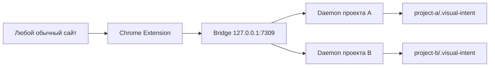

# Локальное Chrome Extension

## Назначение MVP

`VI-CHROME-001` сокращает перенос визуального референса с внешнего сайта в задачу конкретного проекта. Пользователь явно выбирает проект, кликает по DOM-компоненту, добавляет собственный комментарий и при необходимости прикладывает до трёх изображений. Задача попадает в ту же очередь `ready`, что и комментарии proxy-overlay, а работа агента начинается только после `Apply`. В `VI-CHROME-002` тот же сценарий распространяется на доступные `iframe`: селектор работает внутри встроенной страницы, а единый composer открывается поверх основного документа.

Расширение не является загрузчиком сайтов и не пытается воспроизвести чужую бизнес-логику. В MVP оно не скачивает JavaScript, stylesheet-файлы, cookies, local storage, историю, сетевые запросы, видео или сайт целиком.

## Состав визуального пакета

- URL источника без credentials, query и fragment;
- title и размер viewport;
- выбранный DOM-элемент и не более 39 его потомков;
- безопасные HTML-атрибуты: `id`, `class`, `role`, `aria-*`, `alt`, `title`, `type`, очищенные `href` и `src`;
- allowlist computed CSS для layout, typography, цвета, фона, borders, shadow, transform, transition и animation metadata;
- структура parent-child как platform-neutral `Node` и `Relation`;
- координаты выбранного элемента как `Frame` и `Region`;
- пользовательский комментарий;
- до трёх явно приложенных изображений размером до 10 МБ каждое.

Во время выбора расширение показывает рядом с hover-рамкой компактный инспектор: HTML-тег, фактический размер border box, вычисленный цвет текста в HEX и шрифт. Инспектор не перехватывает мышь, удерживается внутри viewport и следует системной светлой или тёмной теме браузера.

Это не гарантирует pixel-perfect копирование само по себе: агент получает достаточно структурированную опору, но проверяет результат уже в коде целевого проекта. Интерактивное поведение пользователь описывает текстом.

## Локальная маршрутизация



Daemon регистрирует сессию в `~/.visual-intent/bridge/sessions/`. Файл имеет права `0600` и содержит токен, который остаётся на серверной стороне. Bridge не доверяет регистрации вслепую: перед показом проекта он запрашивает health endpoint, сверяет ID сессии и канонический корень репозитория. Неактивные или устаревшие регистрации в popup не отображаются.

Расширение соединяется с Bridge по шестизначному коду. После pairing оно хранит отдельный Bridge token в `chrome.storage.local`; токены конкретных проектов ему не выдаются. Browser page не получает Bridge token, потому что сетевые запросы выполняет service worker расширения.

## Разрешения Manifest V3

```json
{
  "permissions": ["activeTab", "scripting", "storage"],
  "host_permissions": ["http://127.0.0.1/*"],
  "optional_host_permissions": ["http://*/*", "https://*/*"]
}
```

- `activeTab` даёт временный доступ только после клика пользователя по расширению;
- `scripting` инжектирует selector/composer в текущую вкладку;
- `storage` запоминает pairing и выбранный проект;
- optional host permissions позволяют Chrome отдельно запросить доступ только к origin видимого стороннего `iframe` на текущей странице;
- loopback host permission нужен только для локального Bridge.

Постоянное разрешение `<all_urls>`, а также `tabs`, `cookies`, `history`, `clipboardRead` и доступ к удалённому backend не используются. Если пользователь отклоняет запрос Chrome, основная страница и same-origin iframe продолжают работать, а закрытый сторонний iframe можно выбрать только как внешний блок.

## Как работает выбор внутри iframe

Service worker запускает независимый selector в каждом разрешённом документе текущей вкладки. Активным считается только фрейм под курсором: остальные рамки и инспекторы скрываются. После клика выбранный фрейм передаёт безопасный DOM/CSS-пакет service worker, а composer всегда открывается в основном документе. В корневой `Node` добавляются очищенные адреса основного документа и iframe без credentials, query и fragment; cookies, значения полей и сетевые запросы не читаются.

## Сборка и установка

```bash
pnpm install
pnpm build
pnpm vip -- bridge
```

Затем в `chrome://extensions` нужно включить режим разработчика и загрузить папку:

```text
<visual-intent-repository>/apps/chrome-extension/dist
```

После каждого изменения исходников выполните:

```bash
pnpm --filter @visual-intent/chrome-extension build
```

и нажмите **Обновить** у карточки расширения. Изменение CLI/Bridge требует `pnpm --filter @visual-intent/cli build` и контролируемого перезапуска Bridge/daemon.

Для проверки same-origin iframe запустите example app на свободном порту и откройте специальную страницу:

```bash
pnpm --filter @visual-intent/example-web exec vite --host 127.0.0.1 --port 5187
```

```text
http://127.0.0.1:5187/iframe-demo.html
```

После запуска Select синяя кнопка «Выбрать эту кнопку» должна получить собственную hover-рамку и инспектор, а composer после клика должен открыться поверх основной страницы.

## Ограничения первой версии

- Chrome запрещает инжектирование в `chrome://`, Chrome Web Store и некоторые системные страницы;
- cross-origin iframe доступен только после отдельного системного разрешения Chrome для его origin;
- sandboxed, служебный или запрещённый браузером iframe может остаться недоступным; тогда расширение выбирает только внешний `<iframe>`;
- pseudo-elements и runtime-состояния не представлены отдельными nodes;
- computed CSS отражает текущее состояние элемента, а не весь набор responsive/hover/focus вариантов;
- изображения не делаются автоматически: пользователь вставляет системный screenshot или файл вручную;
- публичная публикация, аккаунты, облачный backend и синхронизация между компьютерами не входят в MVP.
