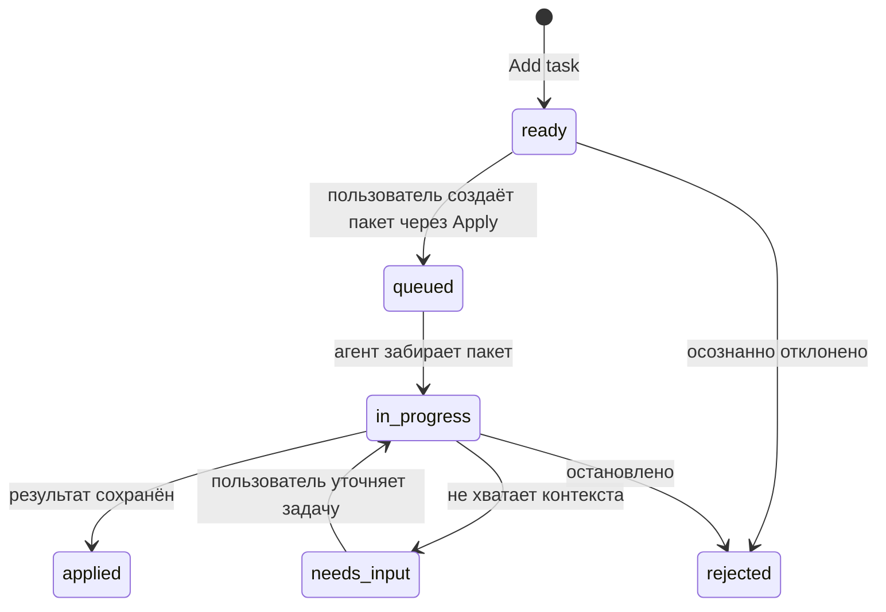
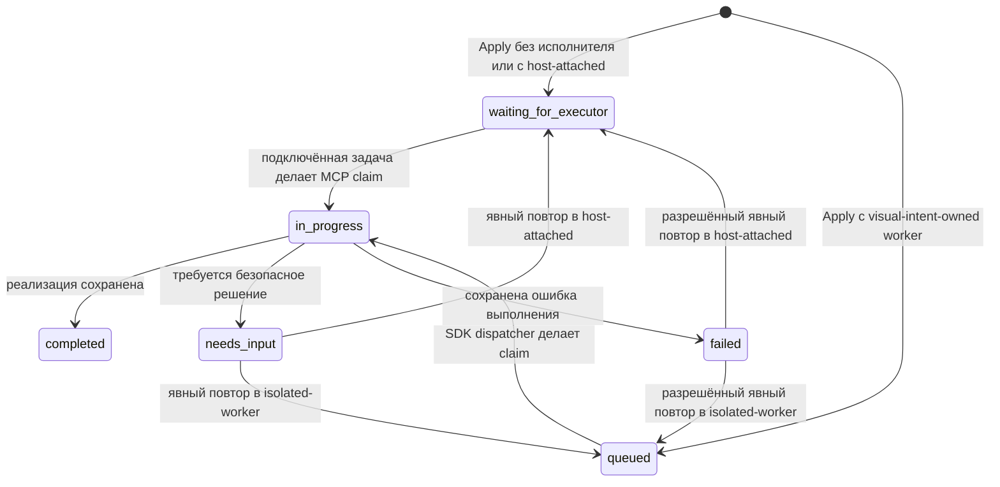

# Протокол

## Цель

Visual Intent Protocol описывает визуальную обратную связь, не делая DOM, React, SwiftUI, UIKit, Jetpack Compose или Android Views частью общего core. Версия `0.1` использует JSON и проверяется во время выполнения через Zod. Независимая от языка JSON Schema публикуется в `packages/protocol/schema/visual-task.schema.json`.

## Сущности

| Сущность         | Значение на разных платформах                         | Пример в web MVP                                              |
| ---------------- | ----------------------------------------------------- | ------------------------------------------------------------- |
| `Surface`        | Экран или canvas, доступный для ревью                 | URL и viewport                                                |
| `Node`           | Семантическая или отображаемая единица                | DOM-элемент и selector                                        |
| `Frame`          | Координатная система в момент фиксации                | viewport, scroll, pixel ratio                                 |
| `Region`         | Прямоугольник в объявленной системе координат         | границы элемента или нарисованная область                     |
| `Relation`       | Типизированная связь между сущностями                 | region привязана к node                                       |
| `Annotation`     | Пользовательская отметка или высказывание             | комментарий к region/node                                     |
| `Intent`         | Запрошенный результат                                 | инструкция на изменение, ревью, вопрос или исправление ошибки |
| `Task`           | Версионируемый рабочий контейнер и его жизненный цикл | элемент `ready`, доступный агенту                             |
| `ProjectSession` | Привязка репозитория и исполнителя                    | один proxy-проект и одна задача Codex                         |
| `ApplyBatch`     | Надёжный контейнер передачи                           | задачи, объединённые одним нажатием Apply                     |

`Task.repository` — необязательный контекст протокола, которым в локальном daemon владеет сервер. Он указывает репозиторий, который должен изучать агент; инжектированная страница не может выбрать или переопределить его.

Native adapters в будущем могут добавлять специфичные для платформы подробности в совместимые поля, но потребители должны иметь возможность работать на основе стабильной общей формы.

## Пример задачи

```json
{
  "protocolVersion": "0.1",
  "id": "task-123",
  "surface": {
    "id": "surface-123",
    "platform": "web",
    "uri": "http://127.0.0.1:7310/settings",
    "title": "Настройки",
    "viewport": { "width": 1440, "height": 900, "devicePixelRatio": 2 },
    "adapter": { "name": "web-overlay", "version": "0.1.0" }
  },
  "nodes": [
    {
      "id": "node-123",
      "surfaceId": "surface-123",
      "kind": "element",
      "name": "button",
      "stableSelector": "[data-testid=save-button]",
      "text": "Сохранить"
    }
  ],
  "frames": [
    {
      "id": "frame-123",
      "surfaceId": "surface-123",
      "x": 0,
      "y": 0,
      "width": 1440,
      "height": 900,
      "scrollX": 0,
      "scrollY": 320,
      "scale": 2
    }
  ],
  "regions": [
    {
      "id": "region-123",
      "surfaceId": "surface-123",
      "frameId": "frame-123",
      "x": 1120,
      "y": 780,
      "width": 120,
      "height": 44,
      "unit": "px",
      "coordinateSpace": "viewport"
    }
  ],
  "relations": [
    {
      "id": "relation-123",
      "type": "anchors",
      "from": { "entity": "region", "id": "region-123" },
      "to": { "entity": "node", "id": "node-123" }
    }
  ],
  "annotations": [
    {
      "id": "annotation-123",
      "kind": "comment",
      "body": "Оставь эту кнопку видимой во время прокрутки формы.",
      "nodeId": "node-123",
      "regionId": "region-123",
      "createdAt": "2026-08-16T12:00:00.000Z"
    }
  ],
  "intent": {
    "id": "intent-123",
    "action": "change",
    "instruction": "Оставь эту кнопку видимой во время прокрутки формы.",
    "acceptanceCriteria": []
  },
  "repository": {
    "root": "/workspace/settings-app",
    "name": "settings-app"
  },
  "batchId": "batch-123",
  "status": "queued",
  "revision": 2,
  "createdAt": "2026-08-16T12:00:00.000Z",
  "updatedAt": "2026-08-16T12:00:00.000Z"
}
```

## Жизненный цикл задачи



Статус `draft` зарезервирован для adapters, поддерживающих сохранение незавершённого намерения. Web MVP сразу создаёт задачи `ready`. Apply не удаляет их из хранилища: он присваивает `batchId` и переводит задачи в `queued`, поэтому они исчезают из редактируемой очереди UI без риска потерять обратную связь.

У Apply-пакета есть собственный жизненный цикл:



`ProjectSession.repository` принадлежит серверу. `AttachExecutor.repositoryRoot` должен точно совпасть с ним до принятия ID задачи Codex. `ProjectExecutor.ownership` явно принимает `host-attached` или `visual-intent-owned`. ID host-задачи используется только как адрес handoff и никогда не передаётся в Codex SDK; SDK может получить только ID собственного worker. Пакет сохраняет снимок ownership и ID, чтобы маршрутизацию можно было проверить после Apply.

Apply идемпотентен относительно готовой очереди: после первого вызова задачи уже имеют `batchId`, поэтому повторный вызов не создаёт копию. Claim атомарен, finish принимается только для `in_progress`, а повтор `failed` разрешён только для структурированно помеченной исправимой причины. Известный legacy-конфликт `active writer` мигрируется в такую исправимую причину без изменения исходных `taskIds`.

Обновление задачи может содержать `expectedRevision`. При каждом принятом обновлении store увеличивает ревизию и отклоняет устаревшее ожидаемое значение через HTTP `409` или ошибку MCP-инструмента.

## HTTP API

| Метод    | Путь                                     | Назначение                                     |
| -------- | ---------------------------------------- | ---------------------------------------------- |
| `GET`    | `/_visual-intent/api/health`             | готовность локального процесса и сессии        |
| `GET`    | `/_visual-intent/api/session`            | привязка проекта и исполнителя                 |
| `POST`   | `/_visual-intent/api/session/attach`     | подключить точный репозиторий и задачу Codex   |
| `GET`    | `/_visual-intent/api/tasks`              | показать задачи, начиная с недавно обновлённых |
| `GET`    | `/_visual-intent/api/tasks?status=ready` | отфильтрованный список                         |
| `GET`    | `/_visual-intent/api/tasks/:id`          | полная задача                                  |
| `POST`   | `/_visual-intent/api/tasks`              | проверить и создать задачу `ready`             |
| `PATCH`  | `/_visual-intent/api/tasks/:id`          | обновить инструкцию, статус или результат      |
| `DELETE` | `/_visual-intent/api/tasks/:id`          | удалить задачу `ready`                         |
| `POST`   | `/_visual-intent/api/tasks/apply`        | создать пакет из всех задач `ready`            |
| `GET`    | `/_visual-intent/api/batches`            | показать сохранённые Apply-пакеты              |
| `GET`    | `/_visual-intent/api/batches/:id`        | получить один пакет                            |
| `POST`   | `/_visual-intent/api/batches/:id/claim`  | забрать ожидающий или `queued` пакет в работу  |
| `POST`   | `/_visual-intent/api/batches/:id/finish` | сохранить завершение, вопрос или ошибку        |
| `POST`   | `/_visual-intent/api/batches/:id/retry`  | повторить пакет `needs_input` или `failed`     |

Запросы на создание не содержат серверные поля задачи: `id`, `status`, `revision`, `createdAt` и `updatedAt`.

Пример обновления:

```json
{
  "expectedRevision": 1,
  "status": "applied",
  "result": {
    "summary": "Панель действий закреплена внутри формы настроек.",
    "changedFiles": ["src/settings/action-bar.tsx"],
    "notes": ["Проверено на мобильной и десктопной ширине."]
  }
}
```

## События WebSocket

Подключение выполняется к `/_visual-intent/ws?token=<session-token>`. После изменения задачи, сессии или пакета daemon отправляет событие:

```json
{
  "type": "batch.completed",
  "batch": { "id": "batch-123", "status": "completed" }
}
```

Сообщения включают изменённую сущность и связанный контекст. Потребители должны игнорировать неизвестные поля будущих событий.

## MCP-мост

Совместимый stdio-сервер предоставляет `visual_intent_list_tasks`, `visual_intent_list_batches`, `visual_intent_retry_batch`, `visual_intent_claim_batch`, `visual_intent_get_task`, `visual_intent_finish_batch` и `visual_intent_update_task`. Плагин Codex добавляет подключение сессии через daemon и те же операции над задачами и пакетами. Получение пакета атомарно переводит сам пакет и все его задачи в `in_progress`.

MCP — transport adapter, а не часть domain model. Агент может использовать возвращённые selector и region как свидетельство, но до изменения кода должен изучить актуальные исходники и runtime, потому что runtime selectors могут устареть.

## Правила версионирования

- `protocolVersion` определяет wire contract, а не версию пакета.
- Добавление необязательных полей совместимо внутри `0.1`.
- Удаление, переименование, изменение смысла или превращение необязательного поля в обязательное требует новой версии протокола и migration notes.
- Adapters указывают собственное имя и версию в `Surface.adapter`.
- Неизвестные версии должны отклоняться, а не интерпретироваться частично.
