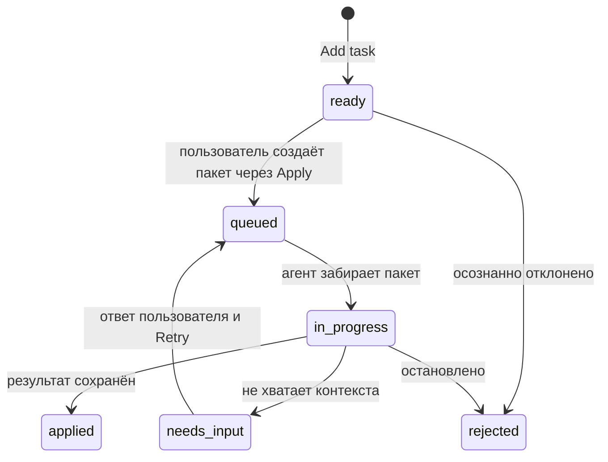
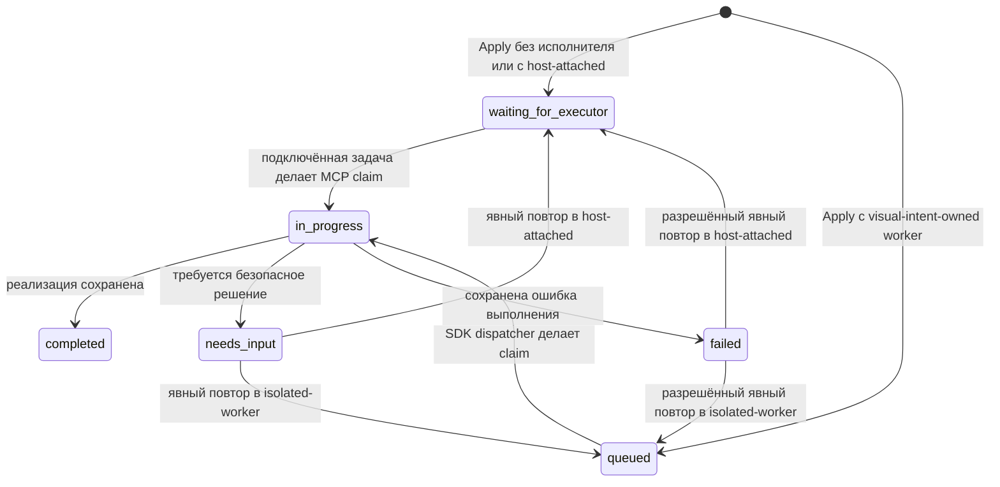

# Протокол

## Цель

Visual Intent Protocol описывает визуальную обратную связь, не делая DOM, React, SwiftUI, UIKit, Jetpack Compose или Android Views частью общего core. Версия `0.1` использует JSON и проверяется во время выполнения через Zod. Независимая от языка JSON Schema публикуется в `packages/protocol/schema/visual-task.schema.json`.

## Сущности

| Сущность            | Значение на разных платформах                          | Пример в web MVP                                              |
| ------------------- | ------------------------------------------------------ | ------------------------------------------------------------- |
| `Surface`           | Экран или canvas, доступный для ревью                  | URL и viewport                                                |
| `Node`              | Семантическая или отображаемая единица                 | DOM-элемент и selector                                        |
| `Frame`             | Координатная система в момент фиксации                 | viewport, scroll, pixel ratio                                 |
| `Region`            | Прямоугольник в объявленной системе координат          | границы элемента или нарисованная область                     |
| `Relation`          | Типизированная связь между сущностями                  | region привязана к node                                       |
| `Annotation`        | Пользовательская отметка или высказывание              | комментарий к region/node                                     |
| `Intent`            | Запрошенный результат                                  | инструкция на изменение, ревью, вопрос или исправление ошибки |
| `Task`              | Версионируемый рабочий контейнер и его жизненный цикл  | элемент `ready`, доступный агенту                             |
| `Attachment`        | Серверно подтверждённое локальное вложение             | PNG-снимок или загруженный файл                               |
| `ProjectSession`    | Привязка репозитория, controller и маршрута исполнения | proxy-проект, рабочая задача и отдельный SDK worker           |
| `ProjectSettings`   | Версионируемые правила текущего проекта                | политика работы поверх незакоммиченных файлов                 |
| `ApplyBatch`        | Надёжный контейнер передачи                            | задачи, объединённые одним нажатием Apply                     |
| `TaskReview`        | Workflow-решение по результату задачи                  | принято, нужна правка или не принято                          |
| `TaskRating`        | Независимая оценка качества результата                 | целое значение от 1 до 5 и время оценки                       |
| `VisualIntentEvent` | Неизменяемый факт жизненного цикла                     | создание, Apply, finish или оценка                            |
| `ExecutionRecord`   | Измеренный результат одной попытки выполнения пакета   | время, usage, операции и результаты задач                     |

`Task.repository` — необязательный контекст протокола, которым в локальном daemon владеет сервер. Он указывает репозиторий, который должен изучать агент; инжектированная страница не может выбрать или переопределить его.

`Task.kind` различает обычную доработку `code-change` и создание выбранного компонента в Figma — `figma-component`. Обе разновидности остаются обычными задачами одной очереди и уходят агенту только в общем Apply-пакете. Для Figma-задачи dispatcher добавляет постоянную базовую инструкцию: воспроизвести выбранный компонент как есть, без придуманных состояний и дополнительной иерархии. Пользовательский комментарий является необязательным уточнением и передаётся отдельно только тогда, когда он заполнен; для `code-change` непустая инструкция остаётся обязательной.

`Task.attachments` содержит не более трёх объектов `Attachment`. Браузер не выбирает локальный `path`: сначала он загружает бинарный файл в daemon, daemon сам создаёт ID, вычисляет SHA-256, размер и проектный путь, а при создании задачи повторно сверяет метаданные со своим хранилищем. Поэтому страница не может подставить агенту произвольный путь на компьютере.

`Task.iterationId`, `rootTaskId`, `previousTaskId` и `round` связывают первоначальный комментарий и последующие уточнения. При чтении старой задачи без этих полей протокол считает её первым раундом отдельной итерации: оба корневых ID равны `Task.id`, а `round = 1`. Технический повтор того же Apply-пакета не создаёт новый раунд задачи: он увеличивает `ApplyBatch.attempt`.

Native adapters в будущем могут добавлять специфичные для платформы подробности в совместимые поля, но потребители должны иметь возможность работать на основе стабильной общей формы.

## Пример задачи

```json
{
  "protocolVersion": "0.1",
  "id": "task-123",
  "kind": "code-change",
  "surface": {
    "id": "surface-123",
    "platform": "web",
    "uri": "http://127.0.0.1:7310/settings",
    "title": "Настройки",
    "viewport": { "width": 1440, "height": 900, "devicePixelRatio": 2 },
    "adapter": { "name": "web-overlay", "version": "0.1.0" }
  },
  "nodes": [
    {
      "id": "node-123",
      "surfaceId": "surface-123",
      "kind": "element",
      "name": "button",
      "stableSelector": "[data-testid=save-button]",
      "text": "Сохранить"
    }
  ],
  "frames": [
    {
      "id": "frame-123",
      "surfaceId": "surface-123",
      "x": 0,
      "y": 0,
      "width": 1440,
      "height": 900,
      "scrollX": 0,
      "scrollY": 320,
      "scale": 2
    }
  ],
  "regions": [
    {
      "id": "region-123",
      "surfaceId": "surface-123",
      "frameId": "frame-123",
      "x": 1120,
      "y": 780,
      "width": 120,
      "height": 44,
      "unit": "px",
      "coordinateSpace": "viewport"
    }
  ],
  "relations": [
    {
      "id": "relation-123",
      "type": "anchors",
      "from": { "entity": "region", "id": "region-123" },
      "to": { "entity": "node", "id": "node-123" }
    }
  ],
  "annotations": [
    {
      "id": "annotation-123",
      "kind": "comment",
      "body": "Оставь эту кнопку видимой во время прокрутки формы.",
      "nodeId": "node-123",
      "regionId": "region-123",
      "createdAt": "2026-08-16T12:00:00.000Z"
    }
  ],
  "attachments": [
    {
      "id": "attachment-123",
      "kind": "screenshot",
      "mimeType": "image/png",
      "fileName": "visual-intent-123.png",
      "byteSize": 48231,
      "sha256": "0123456789abcdef0123456789abcdef0123456789abcdef0123456789abcdef",
      "path": ".visual-intent/attachments/attachment-123.png",
      "width": 1200,
      "height": 760,
      "createdAt": "2026-08-16T12:00:00.000Z"
    }
  ],
  "intent": {
    "id": "intent-123",
    "action": "change",
    "instruction": "Оставь эту кнопку видимой во время прокрутки формы.",
    "acceptanceCriteria": []
  },
  "repository": {
    "root": "/workspace/settings-app",
    "name": "settings-app"
  },
  "batchId": "batch-123",
  "iterationId": "task-123",
  "rootTaskId": "task-123",
  "round": 1,
  "status": "queued",
  "revision": 2,
  "createdAt": "2026-08-16T12:00:00.000Z",
  "updatedAt": "2026-08-16T12:00:00.000Z"
}
```

## Жизненный цикл задачи



Статус `draft` зарезервирован для adapters, поддерживающих сохранение незавершённого намерения. Web MVP сразу создаёт задачи `ready`. Apply не удаляет их из хранилища: он присваивает `batchId` и переводит задачи в `queued`, поэтому они исчезают из редактируемой очереди UI без риска потерять обратную связь.

Техническое завершение, оценка качества и решение о следующем действии разделены. После `applied` пользователь может поставить независимый `TaskRating.value` от 1 до 5. Повторная оценка заменяет прежнюю, увеличивает ревизию задачи и не вызывает откат, повторный запуск или новый раунд.

Отдельный workflow-контракт `TaskReview.outcome` остаётся для явного решения о результате:

- `accepted` — результат принят;
- `needs_revision` — создаётся новая задача той же итерации с `round + 1`, `previousTaskId` и новой инструкцией;
- `not_accepted` — результат не принят, но Visual Intent ничего не откатывает автоматически.

`TaskStatus.rejected` остаётся техническим состоянием остановленной задачи и не означает отрицательную пользовательскую оценку. Откат файлов — отдельное потенциально разрушительное действие, которое не выводится из `not_accepted`.

`Task.displayNumber` — стабильная положительная хронология file adapter и fallback для старых либо ещё не сгруппированных записей. Пользовательский номер в overlay контекстный: редактируемый Backlog (`Task.status = ready` без `batchId`) всегда получает локальные номера `1…N`, одинаковые у карточек и экранных якорей. Apply фиксирует этот порядок в `ApplyBatch.taskIds`; вкладки **In progress** и **Ready** используют индекс задачи внутри конкретного пакета, поэтому номера не меняются при переходе между статусами, а каждая новая пачка снова начинается с `1`. Исторический `displayNumber` не является ID и не используется для конкурентного обновления.

У Apply-пакета есть собственный жизненный цикл:



`ProjectSession.repository` принадлежит серверу. `AttachExecutor.repositoryRoot` должен точно совпасть с ним до принятия ID задачи Codex. Подключённая задача записывается в отдельное поле `ProjectSession.controller`; она может наблюдать сессию, не меняя активный маршрут исполнения. `ProjectSession.executor` описывает активный маршрут Apply, а `ProjectSession.sdkWorker` постоянно сохраняет идентичность автономной SDK-задачи между пакетами и перезапусками. `ProjectExecutor.ownership` явно принимает `host-attached` или `visual-intent-owned`. ID host-задачи используется только как адрес handoff и никогда не передаётся в Codex SDK; SDK может получить только ID собственного worker. Autonomous thread не равен controller и не должен использовать тот же ID. Пакет сохраняет снимок ownership и ID, чтобы маршрутизацию можно было проверить после Apply. Смена executor перенаправляет только `queued` и `waiting_for_executor`; уже выполняющийся пакет не меняет владельца.

`ApplyBatch.projectContext` — ограниченный снимок локального `.visual-intent/context.md` в момент Apply: content-derived `revision`, содержимое и `capturedAt`. Worker использует именно снимок пакета, а не более новую версию файла. Поле необязательно для старых пакетов и проектов без briefing.

`ApplyBatch.workingTreeBaseline` хранит отпечаток незакоммиченного рабочего дерева: время снимка, общий fingerprint и список файлов с Git-статусом и fingerprint содержимого. Служебная `.visual-intent/` не входит в снимок. Baseline сохраняется при любой политике и используется для атрибуции результата.

`ProjectSettings.dirtyWorktreePolicy` принимает `allow-host-attached` или `require-confirmation`. Первый режим пропускает отдельное подтверждение только для подключённого `host-attached` чата и фиксирует `dirtyWorktreeApproval.source = project-settings`; автономный executor этим режимом воспользоваться не может. Второй режим переводит непустой baseline в `needs_input` до явного подтверждения точного fingerprint. Изменение хотя бы одного файла инвалидирует разовое подтверждение.

После `finish` результат различает:

- `preExistingDirtyFiles` — файлы, уже изменённые на момент claim;
- `batchChangedFiles` — файлы, состояние которых изменилось относительно baseline;
- `changedFiles` — совместимое поле, которое в daemon равно `batchChangedFiles`.

Обычный `retry` не подтверждает работу поверх сохранившихся изменений. Он разрешён без подтверждения только после очистки рабочего дерева. Подтверждение выполняется отдельной операцией, чтобы согласие нельзя было вывести из клика по общей кнопке повтора.

Apply идемпотентен относительно готовой очереди: после первого вызова задачи уже имеют `batchId`, поэтому повторный вызов не создаёт копию. Claim атомарен и создаёт `BatchClaim` с уникальным `id`, текущим `attempt`, ownership, целевым executor и для host-attached маршрута — ID controller, который забрал пакет. Finish принимается только для `in_progress` и обязан вернуть этот `id` как `claimId`, тот же `expectedAttempt` и тот же controller thread. Поэтому старый receipt, другая задача Codex или повторный finish не могут записать результат. Повтор `failed` разрешён только для структурированно помеченной исправимой причины. Известный legacy-конфликт `active writer` мигрируется в такую исправимую причину без изменения исходных `taskIds`.

Одновременно допускается только один `visual-intent-owned` пакет в `in_progress`. Проектная `.visual-intent/worker-lease.json` не входит в wire protocol, но атомарно защищает этот инвариант на уровне локального runtime. Живой PID запрещает запуск второго worker; stale или невалидная lease заменяется, а release удаляет файл только при совпадении token. После обнаруженного аварийного обрыва собственный пакет завершается как retryable `failed` с `failureCode = worker_interrupted`, usage `unavailable` и сохранённым частичным diff; retry остаётся явным действием. Host-attached `in_progress` claim автоматически не восстанавливается: daemon не владеет внешним процессом и не может доказать, остановилась ли проектная задача Codex.

`ApplyBatch.attempt` начинается с `1` и увеличивается только при разрешённом техническом retry этого же пакета. Благодаря этому несколько запусков одного пакета не смешиваются с пользовательским раундом уточнения задачи.

Для обычного `needs_input` retry требует непустой пользовательский `answer`. Он сохраняется как `ApplyBatch.continuation` с временем ответа и попадает в следующий agent prompt как пользовательский контекст. В новую попытку входят только `taskResults`, которые не были завершены; они сначала возвращаются в `queued` (пакет — в `queued` для SDK worker или `waiting_for_executor` для host-attached), а уже выполненные задачи остаются `applied` и не запускаются повторно. Dirty-worktree по-прежнему использует отдельный fingerprint approval, а не текстовый ответ.

Обновление задачи может содержать `expectedRevision`. При каждом принятом обновлении store увеличивает ревизию и отклоняет устаревшее ожидаемое значение через HTTP `409` или ошибку MCP-инструмента.

## Аналитика выполнения

После finish агент может вернуть `taskResults`: отдельный итог каждой задачи и её классификацию. `classification.categories` — мультиметка из `style`, `layout`, `text`, `behavior`, `bug`, `image`, `figma` или `unknown`; `classification.scale` — `element`, `region`, `screen`, `multi-screen`, `system` или `unknown`. Классификацию заполняет агент, а не пользователь. `unknown` нельзя сочетать с другой категорией.

Токены измеряются строго на уровне одной попытки Apply-пакета. `BatchUsage` содержит либо подтверждённый `reported` usage с неизменным `scope = apply-batch-turn`, либо `unavailable` с причиной. Пакет с одной задачей даёт точное измерение этой задачи. Для многозадачного пакета точным остаётся только общий usage; карточки могут показывать явно помеченную `≈` аналитическую аллокацию `heuristic-v1`, но она не становится частью provider receipt и не должна называться фактическим usage задачи.

Для собственного SDK worker `BatchUsage` также фиксирует `model`, `reasoningPolicy`, версию adapter и необязательную `apiEquivalentCost`. Денежное поле — не фактический счёт аккаунта, а воспроизводимая **API-эквивалентная оценка**, поэтому в UI перед суммой всегда стоит `≈`: рядом сохраняются использованные ставки, дата снимка и официальный URL источника. Старые выполнения не пересчитываются автоматически при изменении прайса, а просроченный снимок запрещено использовать для новых расчётов до явного обновления. `cachedInputTokens` является частью `inputTokens`, а `reasoningOutputTokens` — частью `outputTokens`; обе величины вычитаются или показываются как детализация и не тарифицируются второй раз.

Первый снимок тарифа закреплён для `gpt-5.6-sol`, standard API и запросов до 272 000 input tokens на один API-вызов: $4 за 1 млн обычных input, $0,40 за 1 млн cached input, $5 за 1 млн cache write и $20 за 1 млн output. SDK сообщает агрегат всего Apply-turn, а не usage каждого внутреннего API-вызова, поэтому повышенный long-context тариф и отдельные комиссии инструментов в эту оценку не входят. В Ready одиночный Apply показывает `$`, `In`, `Out`, `Cache`, `CW`(если значение ненулевое) и`R`на карточке задачи. Многозадачный Apply сохраняет точные цифры в заголовке пакета и выводит под каждой задачей оценочную долю.`heuristic-v1`использует AI-классификацию, масштаб и логарифмически приглушённое число`changedFiles`, нейтрально заполняет отсутствующие сигналы и методом наибольших остатков сохраняет суммы каждого token bucket и стоимости. `Total = input + output`; cached/cache-write входят в input, reasoning входит в output. Для старых execution аллокация вычисляется при чтении без изменения сохранённой истории.

`capture = direct` означает, что usage получен непосредственно от SDK, которым владеет Visual Intent. Для подключённой desktop-задачи допускается только доверенный `host-reported` receipt; если host не передал статистику, сохраняется `unavailable`, а не оценка. `ObservedOperations.completeness` отдельно показывает, полностью или частично adapter наблюдал команды, MCP-вызовы, web search и файловые операции.

Каждая законченная попытка сохраняется как `ExecutionRecord`. Ключ идентичности — сочетание `batchId` и `attempt`; запись содержит длительность, provider/adapter, статус, точный или недоступный usage, наблюдаемые операции и `taskResults`. Terminal batch и execution receipt сначала атомарно сохраняются в основном документе; durable outbox идемпотентно переносит receipt в `executions.jsonl` и позволяет восстановить проекцию после сбоя. События жизненного цикла сохраняются отдельно в append-only `VisualIntentEvent`; текст комментария, DOM-снимок и бинарные вложения в аналитический event не копируются. Агрегатор берёт задачи, пакеты, итерации и оценки из `.visual-intent/tasks.json`, а события и попытки — из `.visual-intent/usage/events.jsonl` и `executions.jsonl`; один журнал `usage/` не является полной аналитической базой.

Итоговый статус пакета вычисляется из `taskResults`, а не принимается на веру из общего поля ответа агента: наличие `failed` даёт `failed`, иначе наличие `needs_input` даёт `needs_input`, иначе пакет считается `completed`. Это не позволяет противоречивому ответу повторно запустить уже завершённую задачу или заблокировать незавершённую.

## Сброс локальной истории

`visual-intent reset --repo <path> --yes` — локальная административная операция adapter, а не изменение wire-протокола. Она удаляет задачи, пакеты, durable execution outbox, `usage/events.jsonl`, `usage/executions.jsonl` и файлы attachments выбранного проекта. Сессия, настройки, подключение, `context.md`, launch-конфигурация и файлы целевого репозитория сохраняются. Операция блокируется, если существует пакет `waiting_for_executor`, `queued` или `in_progress` либо автономный executor занят; это не позволяет очистке оборвать уже переданную агенту попытку.

## HTTP API

| Метод    | Путь                                            | Назначение                                             |
| -------- | ----------------------------------------------- | ------------------------------------------------------ |
| `GET`    | `/_visual-intent/api/health`                    | готовность локального процесса и сессии                |
| `GET`    | `/_visual-intent/api/session`                   | привязка проекта, controller и исполнителя             |
| `POST`   | `/_visual-intent/api/session/attach`            | подключить точный репозиторий и controller Codex       |
| `GET`    | `/_visual-intent/api/settings`                  | получить проектные настройки и их ревизию              |
| `PATCH`  | `/_visual-intent/api/settings`                  | изменить настройки с `expectedRevision`                |
| `GET`    | `/_visual-intent/api/tasks`                     | показать задачи, начиная с недавно обновлённых         |
| `GET`    | `/_visual-intent/api/tasks?status=ready`        | отфильтрованный список                                 |
| `GET`    | `/_visual-intent/api/tasks/:id`                 | полная задача                                          |
| `POST`   | `/_visual-intent/api/tasks`                     | проверить и создать задачу `ready`                     |
| `PATCH`  | `/_visual-intent/api/tasks/:id`                 | обновить инструкцию, статус или результат              |
| `DELETE` | `/_visual-intent/api/tasks/:id`                 | удалить задачу `ready`                                 |
| `POST`   | `/_visual-intent/api/tasks/:id/review`          | оценить результат или создать следующий раунд          |
| `PUT`    | `/_visual-intent/api/tasks/:id/rating`          | поставить или заменить оценку качества от 1 до 5       |
| `POST`   | `/_visual-intent/api/tasks/apply`               | создать пакет из всех задач `ready`                    |
| `POST`   | `/_visual-intent/api/attachments`               | загрузить до 10 МБ и получить серверные метаданные     |
| `GET`    | `/_visual-intent/api/attachments/:id`           | получить локальное вложение                            |
| `DELETE` | `/_visual-intent/api/attachments/:id`           | удалить ещё не нужное локальное вложение               |
| `GET`    | `/_visual-intent/api/batches`                   | показать сохранённые Apply-пакеты                      |
| `GET`    | `/_visual-intent/api/batches/:id`               | получить один пакет                                    |
| `POST`   | `/_visual-intent/api/batches/:id/claim`         | host-attached агент забирает ожидающий пакет           |
| `POST`   | `/_visual-intent/api/batches/:id/finish`        | host-attached агент сохраняет итог                     |
| `POST`   | `/_visual-intent/api/batches/:id/retry`         | повторить пакет `needs_input` или `failed`             |
| `POST`   | `/_visual-intent/api/batches/:id/approve-dirty` | подтвердить точный dirty-baseline пакета               |
| `GET`    | `/_visual-intent/api/events`                    | прочитать append-only события; фильтры `since`, `type` |
| `GET`    | `/_visual-intent/api/executions`                | прочитать выполнения; фильтры `since`, `batchId`       |

Запросы на создание не содержат серверные поля задачи: `id`, `status`, `revision`, `createdAt` и `updatedAt`. Для attachments клиент повторяет только объект, ранее возвращённый upload endpoint; daemon проверяет его по собственному metadata-файлу до сохранения задачи.

Пример обновления:

```json
{
  "expectedRevision": 1,
  "status": "applied",
  "result": {
    "summary": "Панель действий закреплена внутри формы настроек.",
    "changedFiles": ["src/settings/action-bar.tsx"],
    "notes": ["Проверено на мобильной и десктопной ширине."]
  }
}
```

## События WebSocket

Подключение выполняется к `/_visual-intent/ws?token=<session-token>`. После изменения задачи, сессии или пакета daemon всегда отправляет внешний конверт `tasks.changed`; конкретное изменение находится внутри поля `task`:

```json
{
  "type": "tasks.changed",
  "task": {
    "type": "batch.completed",
    "batch": { "id": "batch-123", "status": "completed" },
    "tasks": []
  }
}
```

Для простого создания или изменения задачи `task` может содержать непосредственно объект `Task`; для session/batch/review — внутренний payload с собственным `type`. Потребители должны игнорировать неизвестные поля будущих событий.

WebSocket-сообщения нужны для живого обновления overlay и могут быть потеряны при отключении вкладки. `VisualIntentEvent` в `events.jsonl` — отдельный сохраняемый аналитический журнал; его следует читать через HTTP/SDK, а не восстанавливать из WebSocket.

## MCP-мост

Два MCP-transport намеренно имеют разные возможности:

| Возможность                            | Универсальный stdio-сервер                      | Codex plugin через daemon                                                   |
| -------------------------------------- | ----------------------------------------------- | --------------------------------------------------------------------------- |
| Подключение controller и чтение сессии | Нет; получает `--store` и `--repo` при запуске  | `visual_intent_attach_project`, `visual_intent_get_session`                 |
| Читать задачи и пакеты                 | Да                                              | Да                                                                          |
| Изменять задачу                        | `visual_intent_update_task`                     | Не экспортируется; изменение выполняет overlay/HTTP API                     |
| Читать events/executions               | Да                                              | Да                                                                          |
| Retry с `answer` и dirty approval      | Да                                              | Да                                                                          |
| Claim/finish host-attached             | Controller, `claimId` и attempt передаются явно | ID controller берётся из текущей задачи, claim receipt кешируется до finish |
| Review и следующий раунд               | Да                                              | Да                                                                          |
| Settings и бинарные attachments        | Только через HTTP daemon                        | Только через HTTP daemon                                                    |
| Claim/finish автономного пакета        | Запрещено                                       | Запрещено                                                                   |

Совместимый stdio-сервер предоставляет `visual_intent_list_tasks`, `visual_intent_list_batches`, `visual_intent_list_executions`, `visual_intent_list_events`, `visual_intent_retry_batch`, `visual_intent_approve_dirty_batch`, `visual_intent_claim_batch`, `visual_intent_get_task`, `visual_intent_finish_batch`, `visual_intent_review_task` и `visual_intent_update_task`. Плагин Codex добавляет подключение controller через daemon и те же операции наблюдения, но не произвольное изменение карточки. Claim и finish через MCP принимаются только для `host-attached` пакета; `visual-intent-owned` пакет забирает и завершает внутренний dispatcher. Получение разрешённого пакета атомарно переводит сам пакет и его нерешённые задачи в `in_progress`. Инструмент подтверждения dirty-baseline можно вызывать только после явного согласия пользователя.

При finish агент возвращает отдельные `taskResults` с мультиметочной классификацией. Точный `usage` принимает только adapter, который получил его непосредственно от provider либо через доверенный host receipt; свободный текст агента не считается источником token usage.

MCP — transport adapter, а не часть domain model. Агент может использовать возвращённые selector и region как свидетельство, но до изменения кода должен изучить актуальные исходники и runtime, потому что runtime selectors могут устареть.

## Правила версионирования

- `protocolVersion` определяет wire contract, а не версию пакета.
- Добавление необязательных полей совместимо внутри `0.1`.
- При чтении legacy-задач без lineage автоматически применяются `iterationId = rootTaskId = id` и `round = 1`; legacy-пакеты получают `attempt = 1`.
- `schemaVersion: 1` у event/execution относится к формату аналитической записи и развивается отдельно от `protocolVersion: 0.1` задачи.
- Удаление, переименование, изменение смысла или превращение необязательного поля в обязательное требует новой версии протокола и migration notes.
- Adapters указывают собственное имя и версию в `Surface.adapter`.
- Неизвестные версии должны отклоняться, а не интерпретироваться частично.
