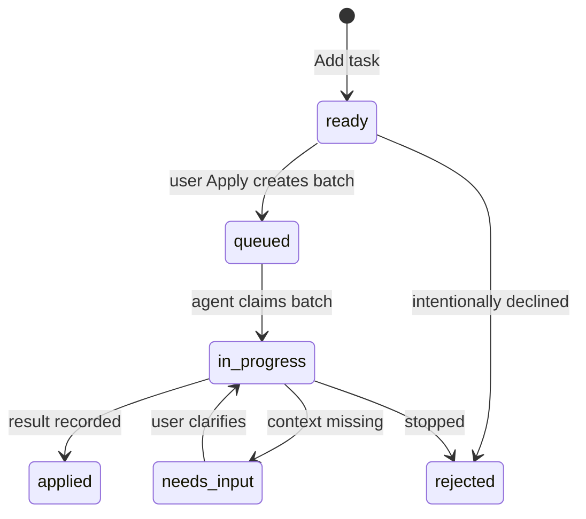
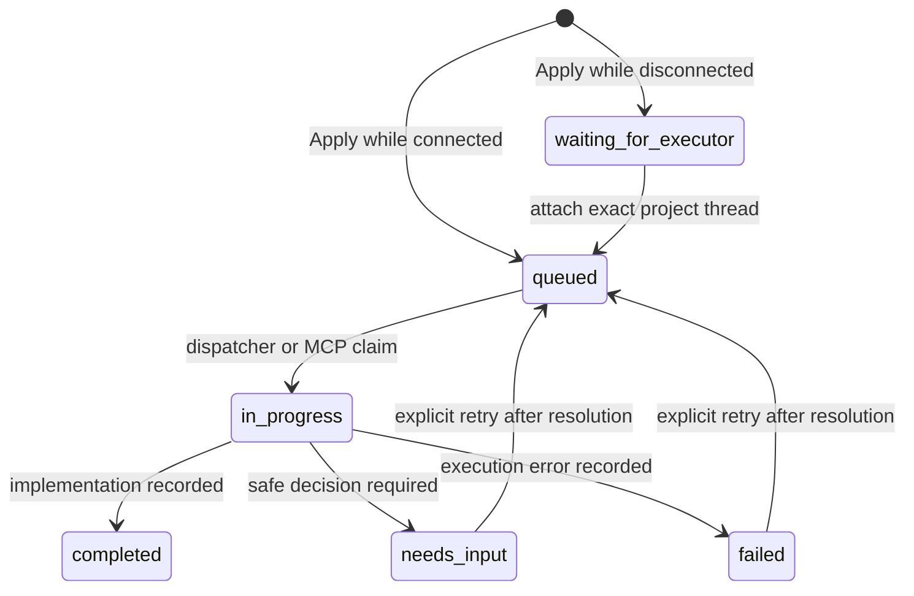

# Protocol

## Goal

Visual Intent Protocol describes visual feedback without making DOM, React, SwiftUI, UIKit, Jetpack Compose, or Android Views part of the shared core. Version `0.1` uses JSON and is validated by Zod at runtime. A language-neutral JSON Schema is published at `packages/protocol/schema/visual-task.schema.json`.

## Entities

| Entity           | Meaning across platforms                 | Web MVP example                              |
| ---------------- | ---------------------------------------- | -------------------------------------------- |
| `Surface`        | A reviewable screen or canvas            | URL and viewport                             |
| `Node`           | A semantic or rendered unit              | DOM element and selector                     |
| `Frame`          | Coordinate reference at capture time     | viewport, scroll, pixel ratio                |
| `Region`         | Rectangle in a declared coordinate space | selected element bounds or drawn rectangle   |
| `Relation`       | Typed link between entities              | region anchors to node                       |
| `Annotation`     | Human mark or statement                  | comment attached to region/node              |
| `Intent`         | Requested outcome                        | change, review, question, or bug instruction |
| `Task`           | Versioned work envelope and lifecycle    | ready item exposed to an agent               |
| `ProjectSession` | Repository and executor binding          | one proxy project and one Codex thread       |
| `ApplyBatch`     | Durable dispatch envelope                | tasks grouped by one Apply click             |

`Task.repository` is optional protocol context but server-owned in the local daemon. It identifies the repository an agent should inspect; the injected page cannot choose or override it.

Native adapters may add platform-specific detail to future compatible fields, but consumers should be able to act from the stable shared shape.

## Task example

```json
{
  "protocolVersion": "0.1",
  "id": "task-123",
  "surface": {
    "id": "surface-123",
    "platform": "web",
    "uri": "http://127.0.0.1:7310/settings",
    "title": "Settings",
    "viewport": { "width": 1440, "height": 900, "devicePixelRatio": 2 },
    "adapter": { "name": "web-overlay", "version": "0.1.0" }
  },
  "nodes": [
    {
      "id": "node-123",
      "surfaceId": "surface-123",
      "kind": "element",
      "name": "button",
      "stableSelector": "[data-testid=save-button]",
      "text": "Save"
    }
  ],
  "frames": [
    {
      "id": "frame-123",
      "surfaceId": "surface-123",
      "x": 0,
      "y": 0,
      "width": 1440,
      "height": 900,
      "scrollX": 0,
      "scrollY": 320,
      "scale": 2
    }
  ],
  "regions": [
    {
      "id": "region-123",
      "surfaceId": "surface-123",
      "frameId": "frame-123",
      "x": 1120,
      "y": 780,
      "width": 120,
      "height": 44,
      "unit": "px",
      "coordinateSpace": "viewport"
    }
  ],
  "relations": [
    {
      "id": "relation-123",
      "type": "anchors",
      "from": { "entity": "region", "id": "region-123" },
      "to": { "entity": "node", "id": "node-123" }
    }
  ],
  "annotations": [
    {
      "id": "annotation-123",
      "kind": "comment",
      "body": "Keep this action visible while the form scrolls.",
      "nodeId": "node-123",
      "regionId": "region-123",
      "createdAt": "2026-08-16T12:00:00.000Z"
    }
  ],
  "intent": {
    "id": "intent-123",
    "action": "change",
    "instruction": "Keep this action visible while the form scrolls.",
    "acceptanceCriteria": []
  },
  "repository": {
    "root": "/workspace/settings-app",
    "name": "settings-app"
  },
  "batchId": "batch-123",
  "status": "queued",
  "revision": 2,
  "createdAt": "2026-08-16T12:00:00.000Z",
  "updatedAt": "2026-08-16T12:00:00.000Z"
}
```

## Task lifecycle



`draft` is reserved for adapters that support saving incomplete intent. The web MVP creates `ready` tasks directly. Apply does not delete them from persistence: it assigns `batchId` and moves them to `queued`, which removes them from the editable UI queue without risking feedback loss.

An Apply batch has its own lifecycle:



`ProjectSession.repository` is server-owned. `AttachExecutor.repositoryRoot` must exactly match it before a thread ID is accepted. A batch stores that executor thread ID when available so routing remains inspectable after the click.

Task updates may carry `expectedRevision`. The store increments the revision on every accepted update and rejects a stale expected revision with HTTP `409` or an MCP tool error.

## HTTP API

| Method   | Path                                     | Purpose                                 |
| -------- | ---------------------------------------- | --------------------------------------- |
| `GET`    | `/_visual-intent/api/health`             | local process and session readiness     |
| `GET`    | `/_visual-intent/api/session`            | project/executor binding                |
| `POST`   | `/_visual-intent/api/session/attach`     | attach an exact repository and thread   |
| `GET`    | `/_visual-intent/api/tasks`              | list newest-updated first               |
| `GET`    | `/_visual-intent/api/tasks?status=ready` | filtered list                           |
| `GET`    | `/_visual-intent/api/tasks/:id`          | full task                               |
| `POST`   | `/_visual-intent/api/tasks`              | validate and create a ready task        |
| `PATCH`  | `/_visual-intent/api/tasks/:id`          | update instruction/status/result        |
| `DELETE` | `/_visual-intent/api/tasks/:id`          | delete a ready task                     |
| `POST`   | `/_visual-intent/api/tasks/apply`        | create a batch from every ready task    |
| `GET`    | `/_visual-intent/api/batches`            | list durable Apply batches              |
| `GET`    | `/_visual-intent/api/batches/:id`        | read one batch                          |
| `POST`   | `/_visual-intent/api/batches/:id/claim`  | claim a queued batch                    |
| `POST`   | `/_visual-intent/api/batches/:id/finish` | record completion, question, or failure |
| `POST`   | `/_visual-intent/api/batches/:id/retry`  | retry a needs-input or failed batch     |

Create requests omit server-owned task fields: `id`, `status`, `revision`, `createdAt`, and `updatedAt`.

Example update:

```json
{
  "expectedRevision": 1,
  "status": "applied",
  "result": {
    "summary": "Made the action bar sticky within the settings form.",
    "changedFiles": ["src/settings/action-bar.tsx"],
    "notes": ["Verified at mobile and desktop widths."]
  }
}
```

## WebSocket events

Connect to `/_visual-intent/ws?token=<session-token>`. After a task, session, or batch change the daemon emits:

```json
{
  "type": "batch.completed",
  "batch": { "id": "batch-123", "status": "completed" }
}
```

Messages include the changed entity and related context. Consumers must ignore unknown future event fields.

## MCP bridge

The compatibility stdio server exposes `visual_intent_list_tasks`, `visual_intent_list_batches`, `visual_intent_retry_batch`, `visual_intent_claim_batch`, `visual_intent_get_task`, `visual_intent_finish_batch`, and `visual_intent_update_task`. The Codex plugin adds daemon-backed session attachment and the same task/batch operations. Claiming atomically moves one batch and all of its tasks to `in_progress`.

MCP is a transport adapter, not part of the domain model. An agent may use a returned selector and region as evidence, but must inspect the current source and runtime before changing code because runtime selectors can become stale.

## Versioning rules

- `protocolVersion` identifies the wire contract, not the package version.
- Additive optional fields are compatible within `0.1`.
- Removing, renaming, changing meaning, or making an optional field required needs a new protocol version and migration notes.
- Adapters identify their own name and version on `Surface.adapter`.
- Unknown versions must be rejected rather than partially interpreted.
